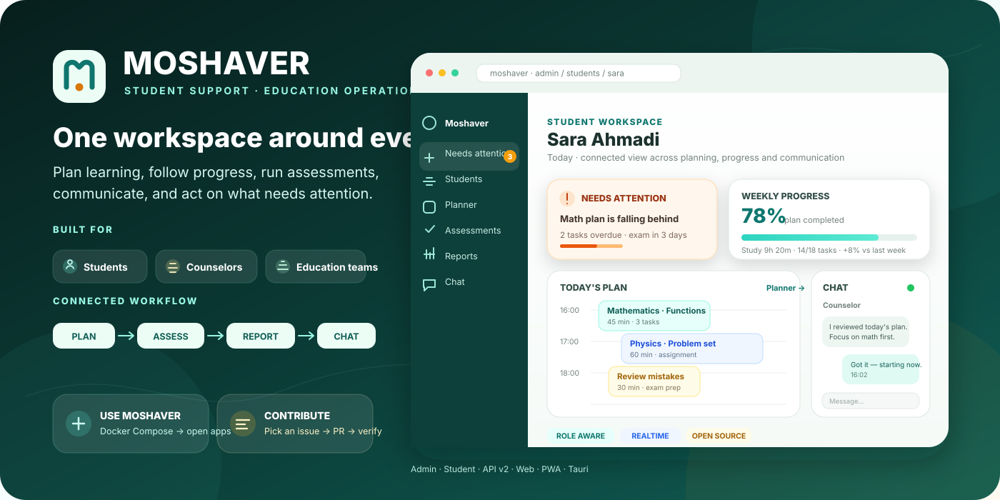
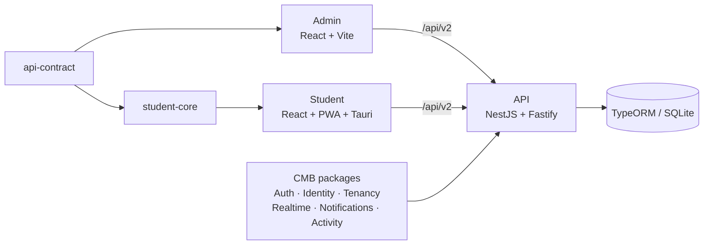

<p align="center">
  
</p>

<h1 align="center">Moshaver v2</h1>

<p align="center">
  <strong>One connected workspace around every student.</strong><br />
  Plan learning, follow progress, run assessments, communicate, and act on what needs attention.
</p>

<p align="center">
  <a href="README.md"><strong>English</strong></a> · <a href="README.fa.md">فارسی</a> ·
  <a href="SHOWCASE.md">Showcase</a> · <a href="docs/README.md">Documentation</a>
</p>

<p align="center">
  <a href="#quick-start"><strong>▶ Run Moshaver</strong></a> ·
  <a href="SHOWCASE.md"><strong>See the product</strong></a> ·
  <a href="CONTRIBUTING.md"><strong>Contribute</strong></a>
</p>

<p align="center">
  
  
  
  
  
</p>

## What is Moshaver?

**Moshaver** is an open-source education operations platform that connects the people and workflows around a student in one system.

Instead of separating planning, assessment, communication, reporting, and follow-up into disconnected tools, Moshaver brings them together through:

- a **role-aware Admin application** for education teams and counselors;
- a **Student application** for plans, learning, assessments, chat, notifications, and progress;
- a **versioned API** with server-enforced authorization and scoped data access;
- shared contracts and modular backend capabilities for long-term maintainability;
- web, PWA, Tauri desktop/native, and Android delivery paths.

The active product line is **v2** on `main` / `develop`. The historical v1.4 source is preserved on `archive/v1.4`.

## Why Moshaver?

Education teams often need to answer simple questions across many separate systems:

> Who needs attention today? What is this student working on? Are they falling behind? What changed after the last assessment? Who has followed up? What should happen next?

Moshaver is designed around that operational loop.

### Product highlights

| Area | What Moshaver provides |
| --- | --- |
| Student operations | Student records, guardian relationships, onboarding, follow-up, scoped access |
| Planning | Study plans, tasks, study sessions, progress and operational follow-up |
| Assessment | Exams, quizzes, questions, mistake/review workflows, recommendations and analytics |
| Communication | Chat, realtime capabilities, notifications and live-oriented admin workflows |
| Learning | Subjects, learning resources and education workflows |
| Reporting | Dashboards, reports, activity and analytics |
| Operations | Needs-attention queues, system tools, retry/recovery flows, import/export |
| Delivery | Admin web app, Student web/PWA, Tauri integration and Android build path |

See the **[product showcase](SHOWCASE.md)** for a guided walkthrough of the main flows.

## A connected student workflow

Moshaver is designed so operators do not lose context when moving between tools.

A typical workflow is:

1. Open **Needs attention** to see urgent student or system items.
2. Select a student and review their current context.
3. Move into **Planner** to inspect or adjust work.
4. Open **Reports** to understand progress and activity.
5. Continue the conversation in **Chat**.
6. Review **Assessments** and follow-up items.
7. Use role/capability-aware actions without bypassing server-side authorization.

The exact screens and actions available depend on the user's role, capabilities, organization, and student scope.

## Applications

| Project | Purpose | Main stack | Local port |
| --- | --- | --- | ---: |
| [`apps/admin/`](apps/admin/) | Role-aware education operations | React 18 + Vite | `8081` |
| [`apps/student/`](apps/student/) | Student web/PWA/native experience | React 18 + Vite + Tauri | `8080` |
| [`apps/api/`](apps/api/) | Versioned backend and composition root | NestJS 11 + Fastify + TypeORM | `4000` |
| [`student-core/`](student-core/) | Runtime-neutral student domain/contracts | TypeScript | — |
| [`packages/api-contract/`](packages/api-contract/) | Shared API contract boundary | TypeScript | — |
| [`packages/cmb/`](packages/cmb/) | Composable backend capabilities | TypeScript | — |

## Architecture

Moshaver is a **grouped product monorepo** with a **modular-monolith backend**.



The backend remains the composition root while reusable capabilities are extracted incrementally into **CMB — Composable Modular Backend Architecture** packages.

Start here for deeper technical detail:

- [Architecture overview](ARCHITECTURE.md)
- [System map](docs/architecture/system-map.md)
- [Repository architecture](docs/architecture/repository-architecture.md)
- [Dependency boundaries](docs/architecture/dependency-boundaries.md)
- [Backend v2 design](docs/architecture/backend-v2-design.md)
- [Student/Tauri runtime](docs/architecture/student-v2-tauri-runtime.md)

## Quick start

### Run the complete stack with Docker

Requirements: **Git** and **Docker Compose**.

```bash
git clone https://github.com/Mobin-Karam/moshaver.git
cd moshaver
docker compose up --build
```

Open:

| Service | URL |
| --- | --- |
| Student app | `http://localhost:8080` |
| Admin app | `http://localhost:8081` |
| API health | `http://localhost:4000/health` |
| API readiness | `http://localhost:4000/ready` |
| Swagger | `http://localhost:4000/api/v2/docs` |
| OpenAPI JSON | `http://localhost:4000/api/v2/openapi.json` |

Stop with:

```bash
docker compose down
```

Do not add `--volumes` unless deleting local persisted data is intentional.

### Local development

Repository tooling expects Node.js `>=22.13.0 <23`.

```bash
npm run bootstrap
npm run workspace:check
```

Backend:

```bash
cp apps/api/.env.example apps/api/.env
npm --prefix apps/api run migration:run
npm --prefix apps/api run seed
npm --prefix apps/api run dev
```

Frontend:

```bash
npm --prefix apps/admin run dev
# or
npm --prefix apps/student run dev
```

Never commit generated `.env` files, tokens, private keys, production data, or credentials.

## Technology

| Layer | Main technologies |
| --- | --- |
| Admin | React 18, Vite 6, React Router 7, TanStack Query, React Hook Form, Zod, Tailwind CSS |
| Student | React 18, Vite 5, Zustand, Tailwind CSS, Tauri 2 |
| API | NestJS 11, Fastify, TypeORM, Swagger/OpenAPI, class-validator, Zod |
| Persistence | SQLite / `better-sqlite3` through TypeORM in the default local topology |
| Testing | Jest, Vitest, Testing Library, axe-core, Playwright |
| Delivery | Docker Compose, PWA, Tauri, Android build path |

## Repository structure

```text
moshaver/
├── apps/
│   ├── admin/          # Admin v2
│   ├── api/            # Backend API v2
│   └── student/        # Student web/PWA/Tauri app
├── packages/
│   ├── api-contract/   # Shared API contracts
│   └── cmb/            # Reusable backend capabilities
├── student-core/       # Runtime-neutral student domain package
├── docs/               # Architecture, product, operations and release docs
├── tooling/            # Workspace, architecture and generator tooling
├── scripts/
├── examples/
├── ARCHITECTURE.md
├── SHOWCASE.md
└── README.md
```

## API

The main API prefix is:

```text
/api/v2
```

Health endpoints remain outside the versioned prefix:

```text
/health
/ready
```

Interactive documentation is available at `/api/v2/docs`, with the machine-readable schema at `/api/v2/openapi.json`.

See [Backend v2 HTTP API](docs/components/backend-v2-http-api.md).

## Quality and security

Useful repository-level checks:

```bash
npm run workspace:check
npm run architecture:check
npm run contracts:check
npm run verify
npm run docs:check
```

Security-sensitive behavior is enforced on the server. The active backend includes capability authorization, organization/student scoping, validation, CORS, Helmet, cookie-based authentication flows, CSRF expectations for authenticated mutations, migrations, and dedicated security testing.

Please do **not** disclose suspected vulnerabilities in public issues. Follow [SECURITY.md](SECURITY.md).

## Documentation

| Need | Start here |
| --- | --- |
| See the product | [SHOWCASE.md](SHOWCASE.md) |
| Understand the repo | [ARCHITECTURE.md](ARCHITECTURE.md) |
| Browse all docs | [docs/README.md](docs/README.md) |
| Run and verify locally | [Repository runbook](docs/operations/repository-runbook.md) |
| Make a safe change | [Developer handbook](docs/operations/developer-handbook.md) |
| Understand Admin coverage | [Admin capability matrix](docs/ADMIN_V2_CAPABILITY_MATRIX.md) |
| Review product direction | [Version roadmap](docs/product/version-roadmap.md) |
| Review changes | [Product changelog](docs/releases/product-changelog.md) |

## Contributing

Contributions are welcome. Read [CONTRIBUTING.md](CONTRIBUTING.md) before opening a pull request.

Moshaver uses leaf lockfiles and a repository workspace graph rather than a root npm workspace lockfile. Follow the repository's architecture and dependency-boundary rules when changing shared code.

## License

Moshaver is licensed under the **MIT License**. See [LICENSE](LICENSE).

---

<p align="center">
  <strong>Moshaver v2</strong><br />
  One connected workspace for student planning, learning, communication, assessment, and follow-up.
</p>
